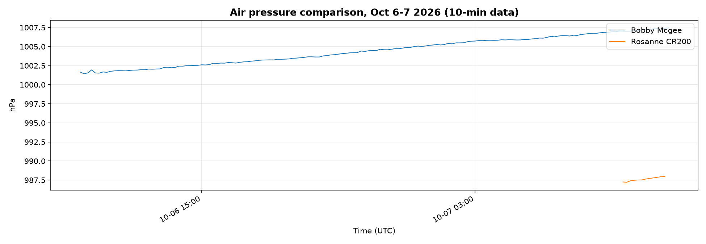
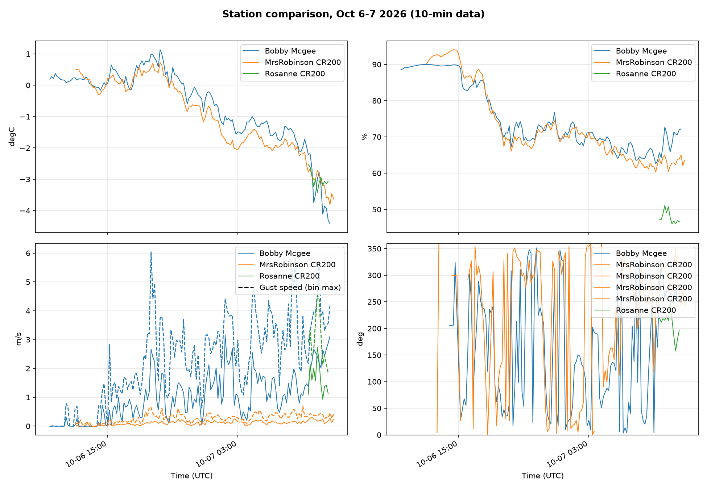

# AWS Field Data Plots - October 6-7 2026 (10-min data)

## Bobby Mcgee_ExtraSensors

## Bobby Mcgee_Overview

## Bobby Mcgee_WindRose

## Comparison_AirPressure

## Comparison_Overview

## MrsRobinson CR200_Overview

## MrsRobinson CR200_WindRose

## Rosanne CR200_ExtraSensors

## Rosanne CR200_Overview

