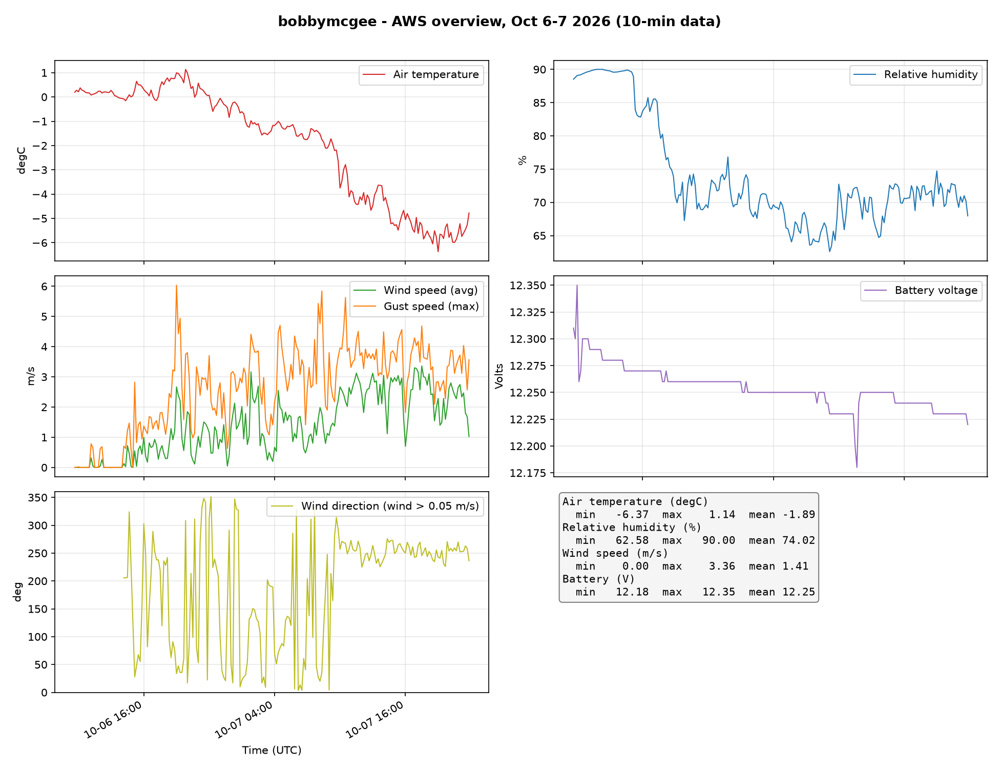
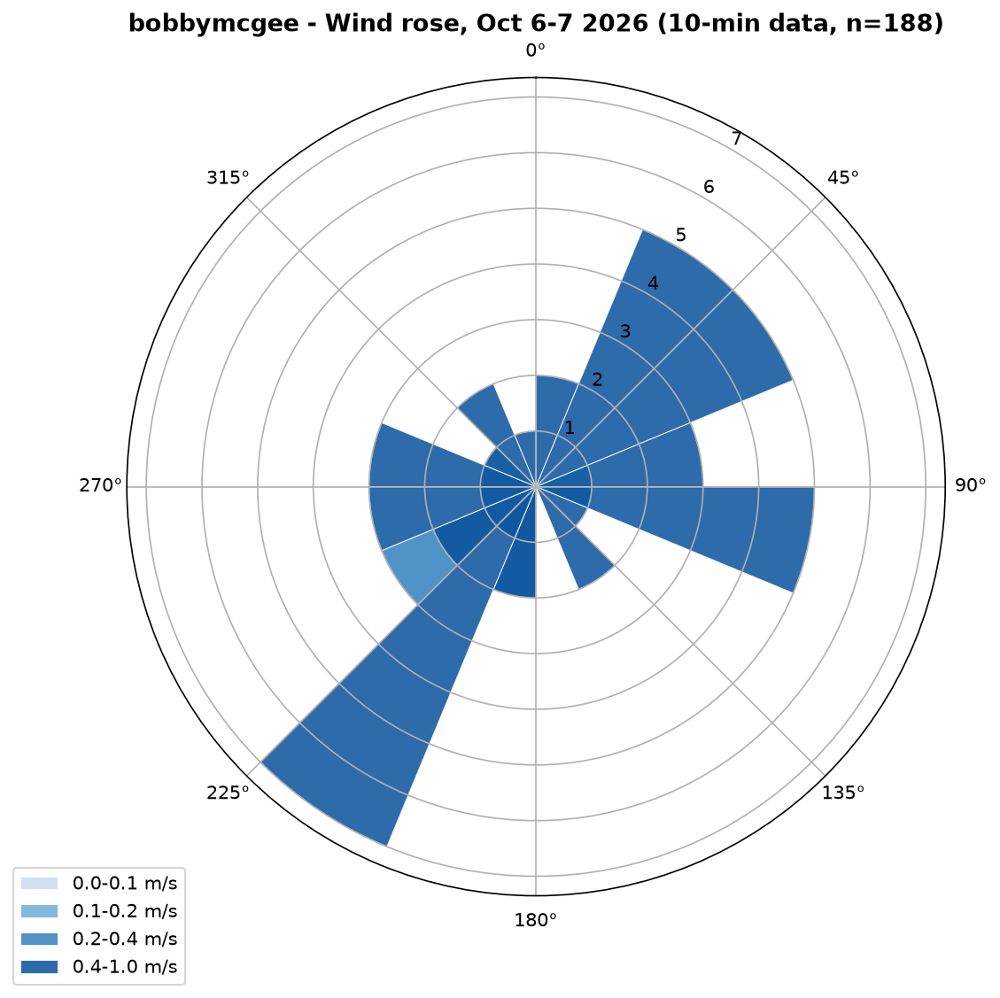
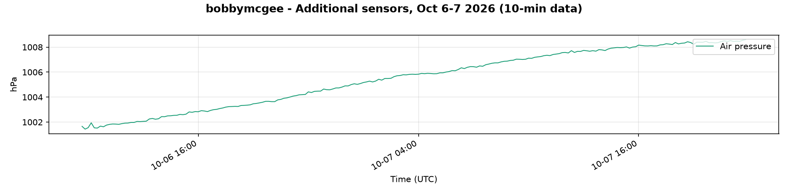
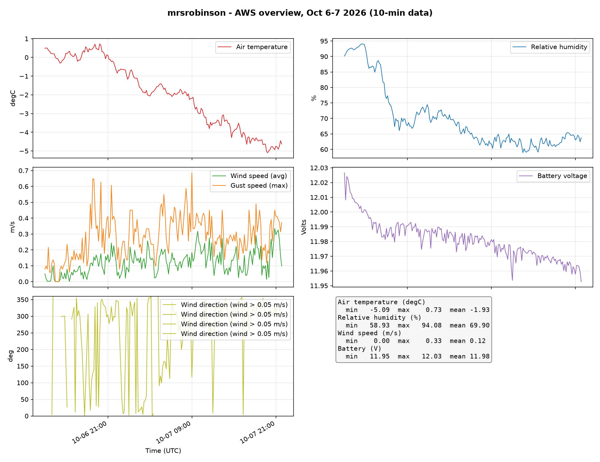
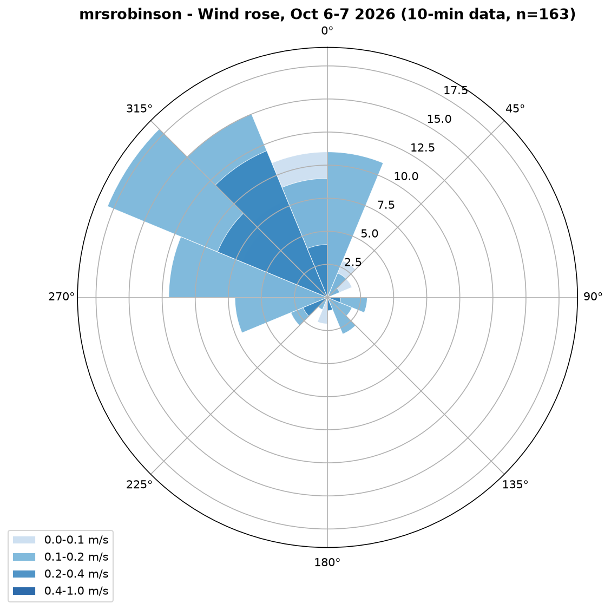
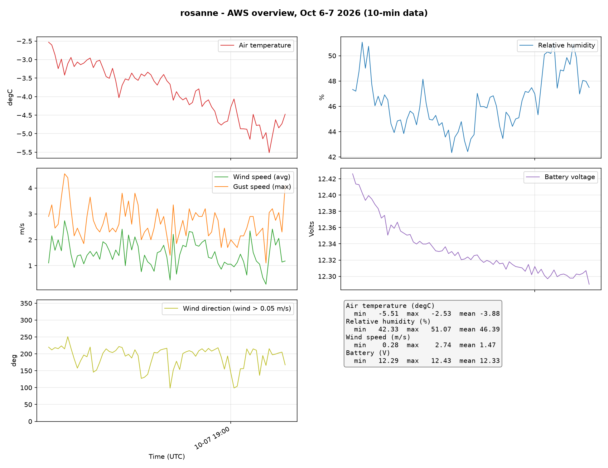
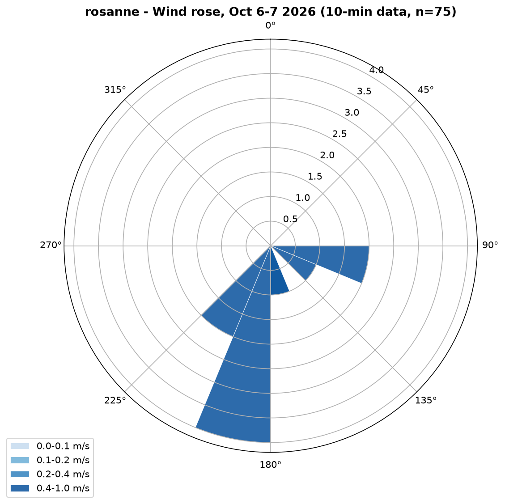
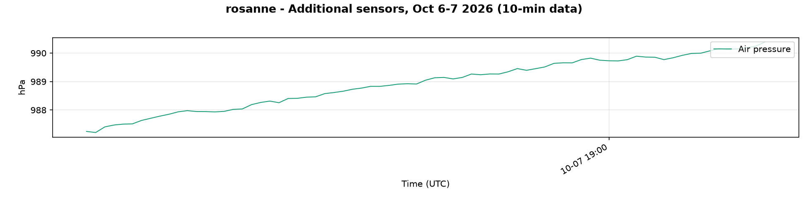
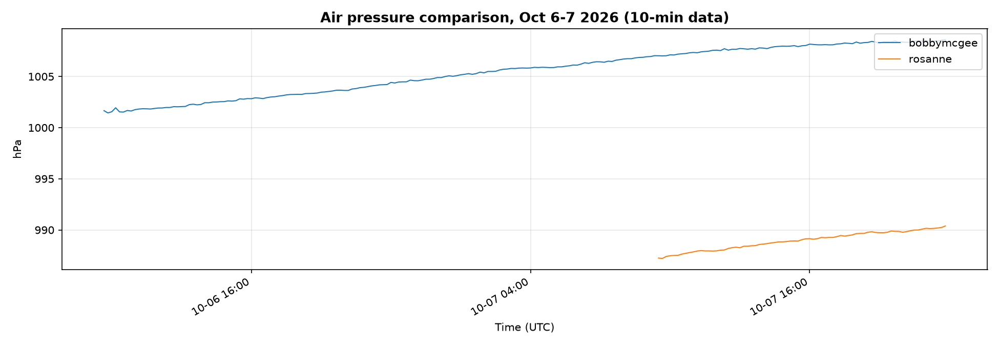
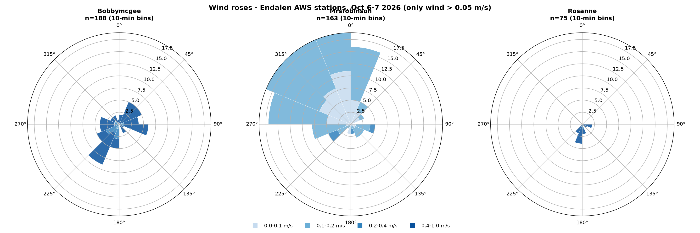

# AWS field data plots — October 6–7, 2026 (10-min data)

Generated with `03_data_analysis/src/analyze_aws_data.py` from the continuous AWS dumps in `03_data_analysis/data/`.

## Station map

Station positions (Endalen / Adventdalen) on an OpenStreetMap background, with the iMET drone GPS tracks — generated by `03_data_analysis/src/plot_station_map.py`.

## Station map — Endalen valley zoom

Zoom on the three Endalen AWS stations (Bobby McGee, Mrs Robinson, Rosanne) on the NPI Basiskart Svalbard topographic background (same service as toposvalbard.npolar.no, relief + contour lines), with drone GPS tracks and station-to-station distances — generated by `03_data_analysis/src/plot_valley_map.py`.

## bobbymcgee_Overview

## bobbymcgee_WindRose

## bobbymcgee_ExtraSensors

## mrsrobinson_Overview

## mrsrobinson_WindRose

## rosanne_Overview

## rosanne_WindRose

## rosanne_ExtraSensors

## Comparison_Overview

## Comparison_AirPressure

## Wind roses side by side (3 stations)

All three Endalen AWS wind roses in one figure for direct comparison (shared radial scale, same speed classes) — generated by `03_data_analysis/src/plot_windrose_comparison.py`.

---

# Drone flight plots — October 7–8, 2026

All drone results live in the dedicated folder `04_plots/drone/`, generated by `03_data_analysis/src/analyze_drone_data.py` from the DJI telemetry and iMET sonde CSVs in `03_data_analysis/data/drone/`.

- `X_profile_*.png` — iMET vertical profiles per flight: air temperature (bottom axis) and relative humidity (top axis) vs pressure-based altitude above launch. Note: iMET humidity raw values are scaled by 1/10 (not 1/100 like pressure/temperature).
- `X_wind_*.png` — DJI wind per flight: wind speed vs altitude above takeoff (colour = wind direction from DJI telemetry) and altitude / direction vs flight time.
- `*_overview.png` — one overview time series per iMET record file, with flight boundaries (UTC) marked.
- Flights without attribution yet (icing tests, early 2026-10-07 files) are plotted under their raw file names.

## Cross-flight comparisons

- `endalen_profiles_comparison_20261008.png` — Endalen T/RH profiles F01b–F06 overlaid (valley transect 08:50–10:18 UTC).
- `dji_wind_profiles_comparison_20261008.png` — DJI wind speed profiles of all attributed 2026-10-08 flights overlaid.

Known artifacts: `F09a_profile_20261008.png` shows the pre-launch indoor reading (~+12 degC, flight only reached 1.7 m); `F01a` profiles/wind are from the aborted attempt (payload was off).
