# Field data plots — October 2026

Index of all generated plots in this repo. Layout: per-station folders (`bobbymcgee/`, `mrsrobinson/`, `rosanne/`), `windrose/` (all wind roses), `maps/`-style figures and comparison plots, `drone/` (drone flights), `archive/` (superseded plots). Regenerate with the `03_data_analysis/src/` scripts.

## AWS — October 6–8, 2026 (10-min data)

Windows: October 6–8, 2026, 10-min bins. Data end on October 8 with the morning logger downloads (08:50–10:18 UTC), so the day is partial. The single Oct 8 dumps already contain the full Oct 6–7 records. Generated with `03_data_analysis/src/analyze_aws_data.py` from `03_data_analysis/data/20261008_*_endalen_1min.dat`.

### bobbymcgee

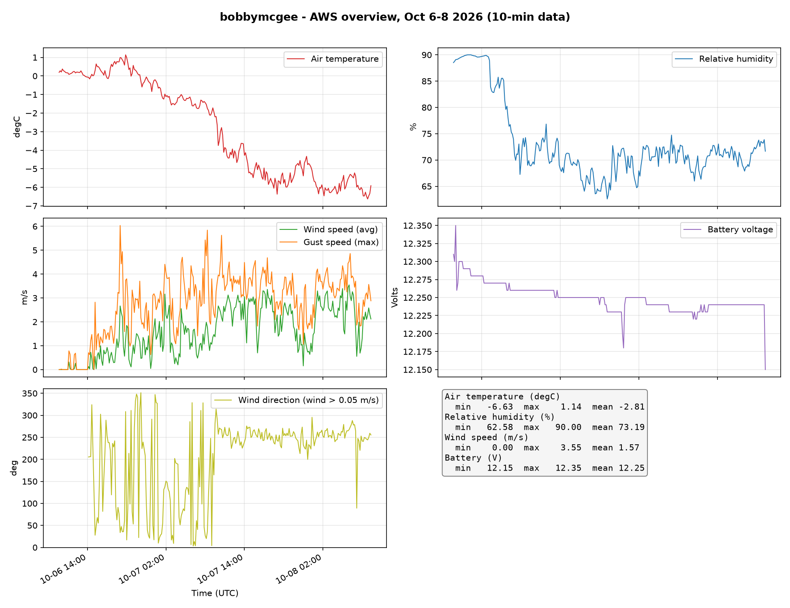
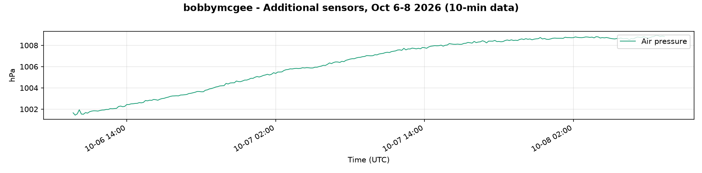

### mrsrobinson

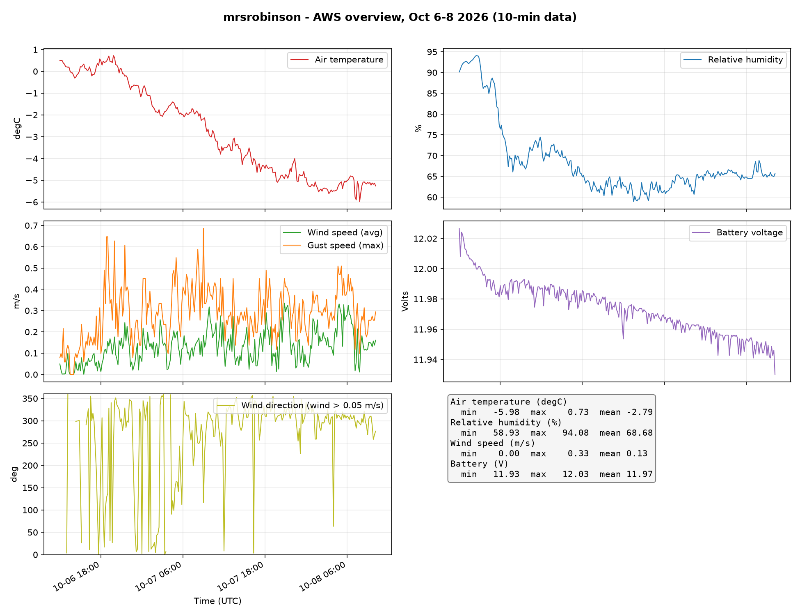

### rosanne

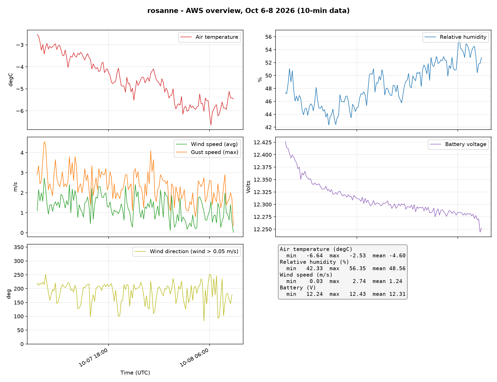
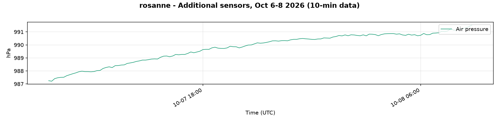

### Wind roses

Radial axis: % of 10-min bins (frequency of each 16-sector direction class), stacked by wind speed class.

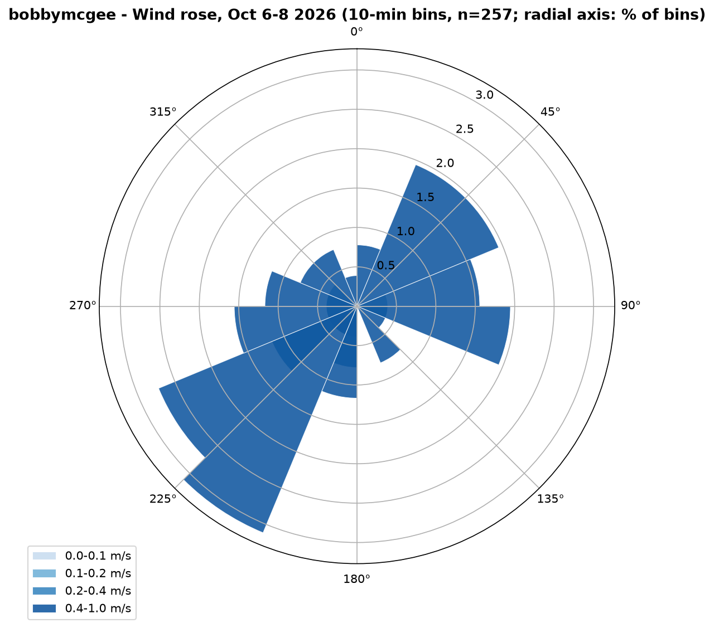
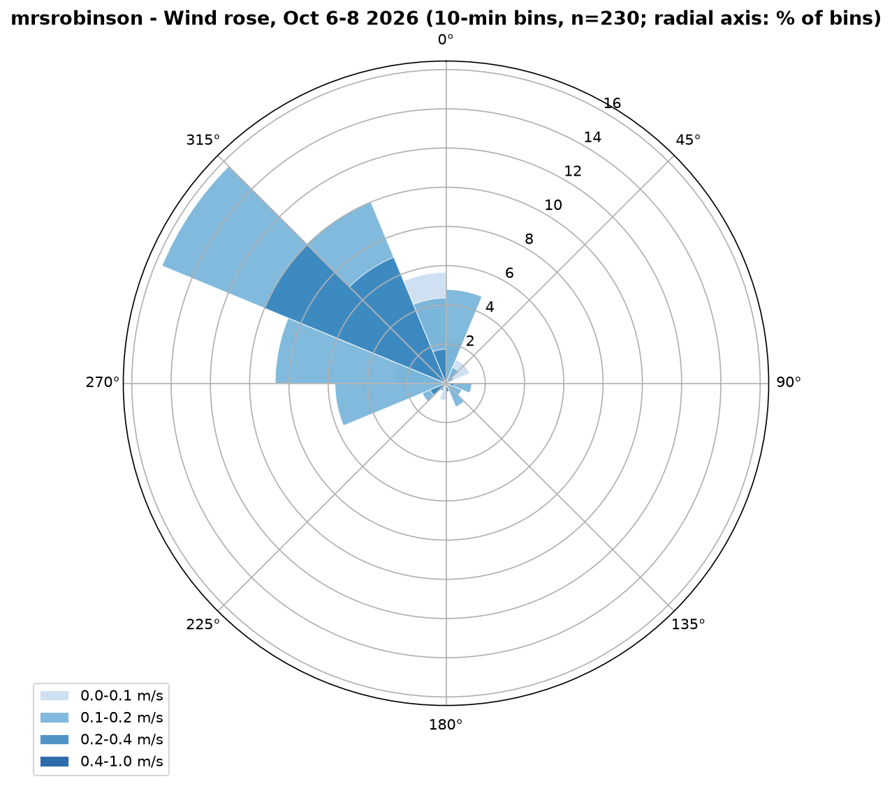
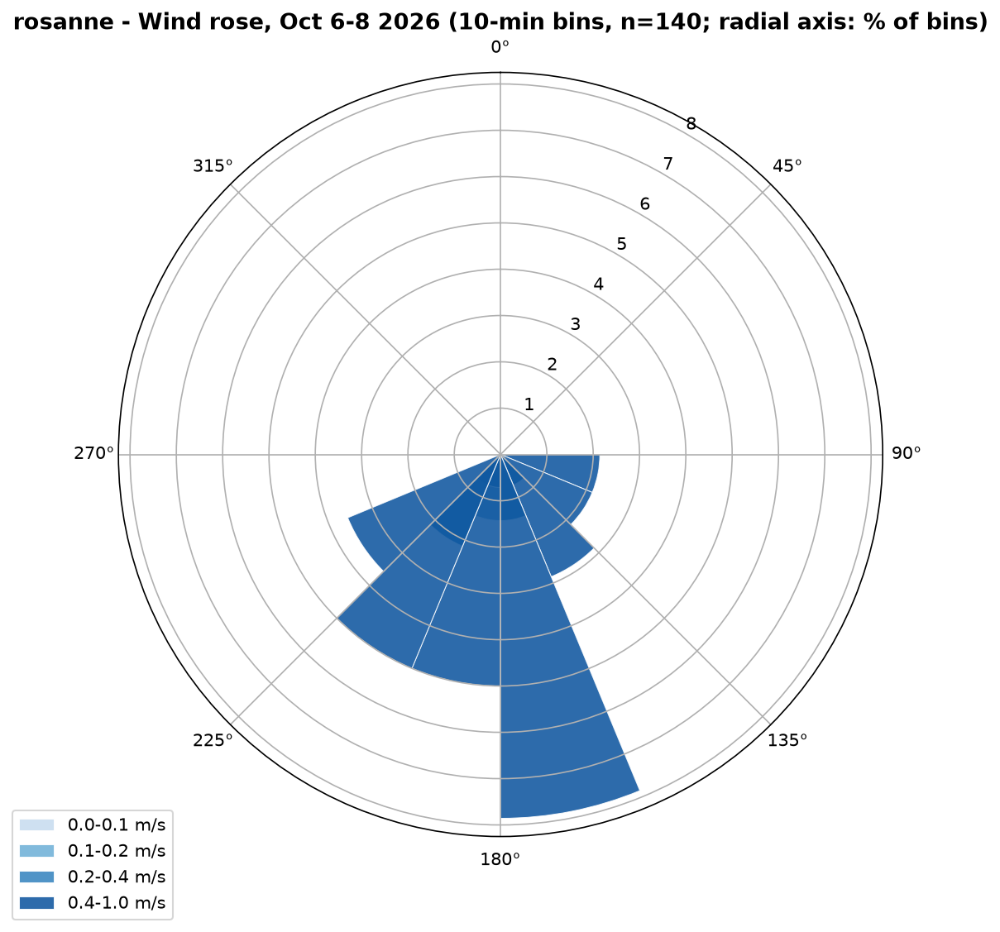

All three Endalen AWS wind roses in one figure for direct comparison (shared radial scale, same speed classes) — generated by `03_data_analysis/src/plot_windrose_comparison.py`:

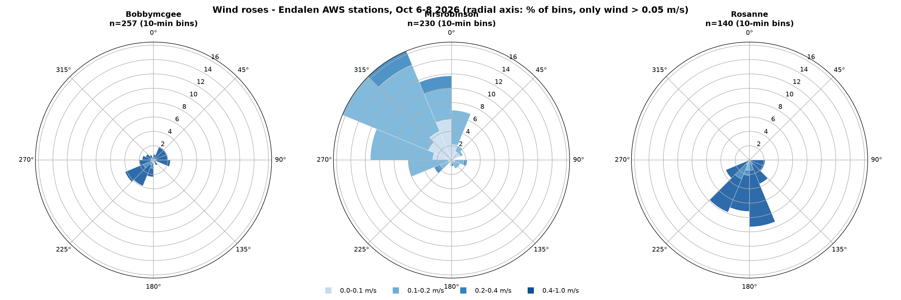

### Station comparisons

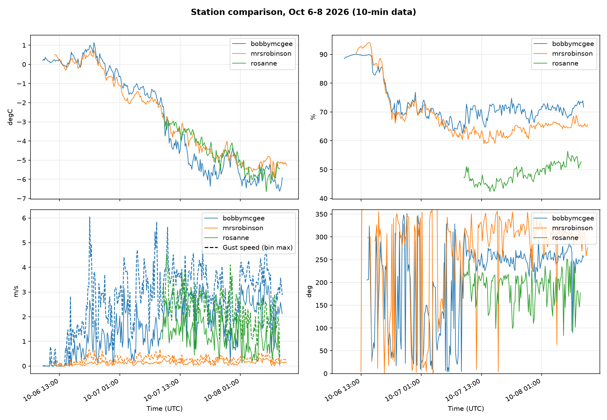
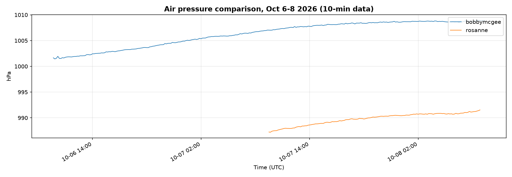

## Station maps

Station positions (Endalen / Adventdalen) on an OpenStreetMap background, with the iMET drone GPS tracks — generated by `03_data_analysis/src/plot_station_map.py`:

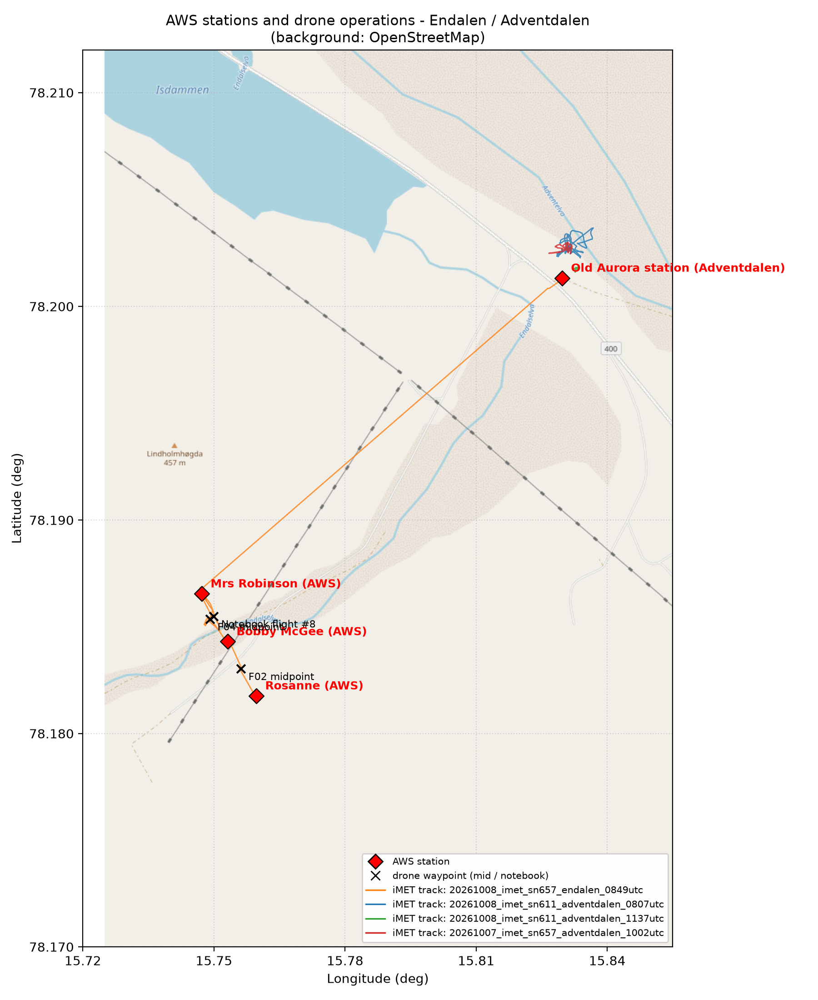

Zoom on the three Endalen AWS stations on the NPI Basiskart Svalbard topographic background (relief + contour lines), with drone GPS tracks and station-to-station distances — generated by `03_data_analysis/src/plot_valley_map.py`:

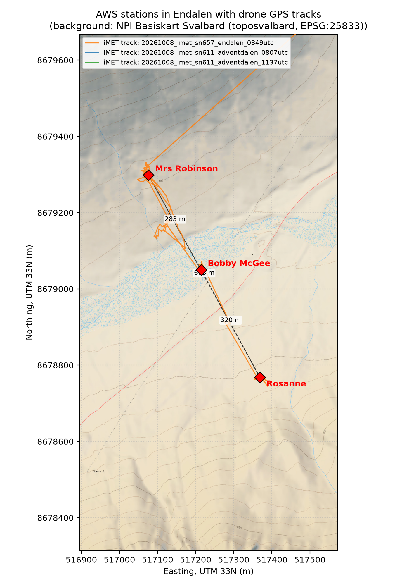

---

# Drone flight plots — October 7–8, 2026

All drone results live in the dedicated folder `drone/`, generated by `03_data_analysis/src/analyze_drone_data.py` from the DJI telemetry and iMET sonde CSVs in `03_data_analysis/data/drone/`.

- `X_profile_*.png` — iMET vertical profiles per flight: air temperature (bottom axis) and relative humidity (top axis) vs pressure-based altitude above launch. Note: iMET humidity raw values are scaled by 1/10 (not 1/100 like pressure/temperature).
- `X_wind_*.png` — DJI wind per flight: wind speed vs altitude above takeoff (colour = wind direction from DJI telemetry) and altitude / direction vs flight time.
- `*_overview.png` — one overview time series per iMET record file, with flight boundaries (UTC) marked.
- Flights without attribution yet (icing tests, early 2026-10-07 files) are plotted under their raw file names.

## Cross-flight comparisons

- `drone/endalen_profiles_comparison_20261008.png` — Endalen T/RH profiles F01b–F06 overlaid (valley transect 08:50–10:18 UTC).
- `drone/dji_wind_profiles_comparison_20261008.png` — DJI wind speed profiles of all attributed 2026-10-08 flights overlaid.

Known artifacts: `drone/F09a_profile_20261008.png` shows the pre-launch indoor reading (~+12 degC, flight only reached 1.7 m); `drone/F01a_*` are from the aborted attempt (payload was off).

## Archive

Superseded Oct6-7 versions of the AWS plots moved to `archive/`; the corresponding files are also in git history.
